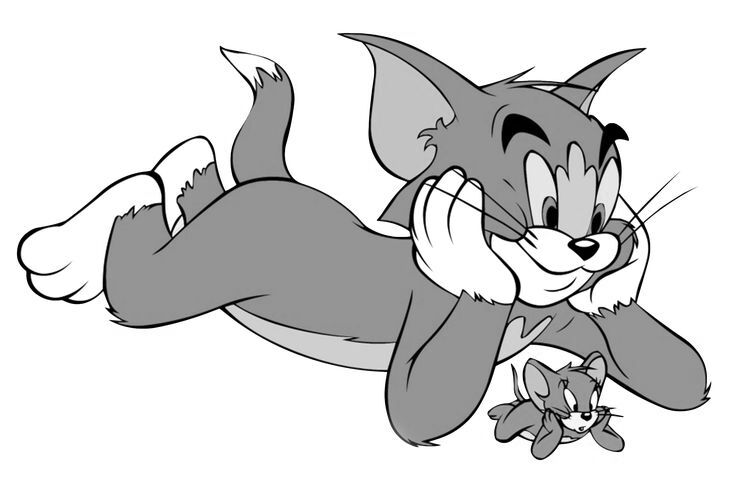
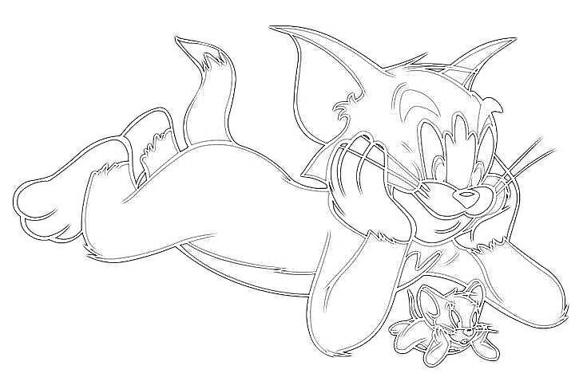
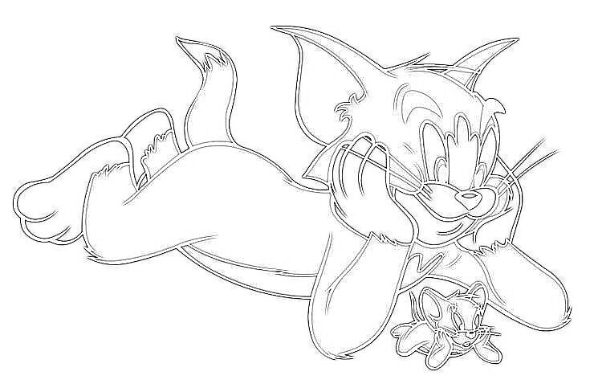
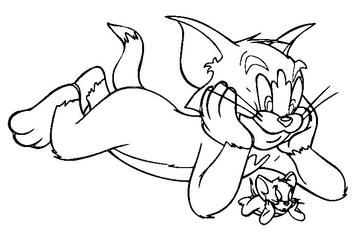
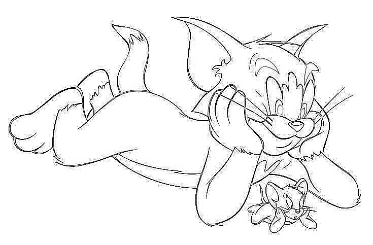
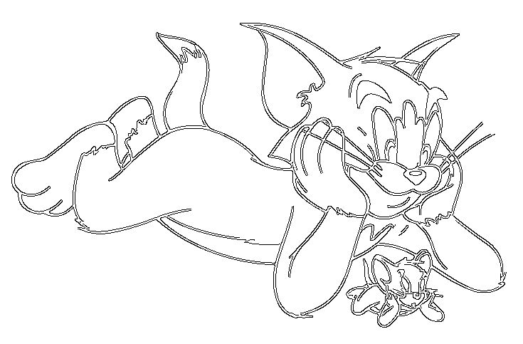

# ImageMagick_Tricks_Collection
Some ImageMagick tricks that I collect.

## Picture Stencil Maker

From https://blog.jiayu.co/2019/05/edge-detection-with-imagemagick/.


### Preprocessing

We first grayscale this picture and remove the alpha's.

```bash
convert tomjerry.jpg -colorspace gray -alpha remove tomjerry-preprocessed.jpg
```



### Convolution

#### Difference of Gaussians

```bash
convert tomjerry-preprocessed.jpg \
	-morphology Convolve DoG:1,0,1 \
	-negate \
	-tint 0 \
	tomjerry_laplacian_isotropic.jpg
```


#### Discrete Laplacian kernels

```bash
convert tomjerry-preprocessed.jpg \
	-define convolve:scale='!' \
	-morphology Convolve Laplacian:0 \
	-negate \
	-tint 0 \
	tomjerry_laplacian_0.jpg
```



#### Sobel operator

```bash
convert tomjerry-preprocessed.jpg \
        -define convolve:scale='50%!' \
        -bias 50% \
        \( -clone 0 -morphology Convolve Sobel:0 \) \
        \( -clone 0 -morphology Convolve Sobel:90 \) \
        -delete 0 \
        -solarize 50% \
        -level 50,0% \
        -compose Lighten \
        -composite \
        -negate \
        tomjerry_sobel_maximum_3.jpg
```


#### Roberts Cross algorithm

```bash
convert tomjerry-preprocessed.jpg \
	-define morphology:compose=Lighten \
	-morphology Convolve 'Roberts:@' \
	-negate \
	-gaussian-blur 1x1 \
	-auto-threshold OTSU \
	tomjerry_roberts_maximum_threshold.jpg
```



### Computer vision transformations

#### Edge detection

```bash
convert tomjerry-preprocessed.jpg -negate -edge 1 -negate tomjerry-edge.jpg
```



#### Canny edge detector

```bash
convert tomjerry-preprocessed.jpg \
	-canny 0x1+10%+30% -negate \
	tomjerry-canny.jpg
```


